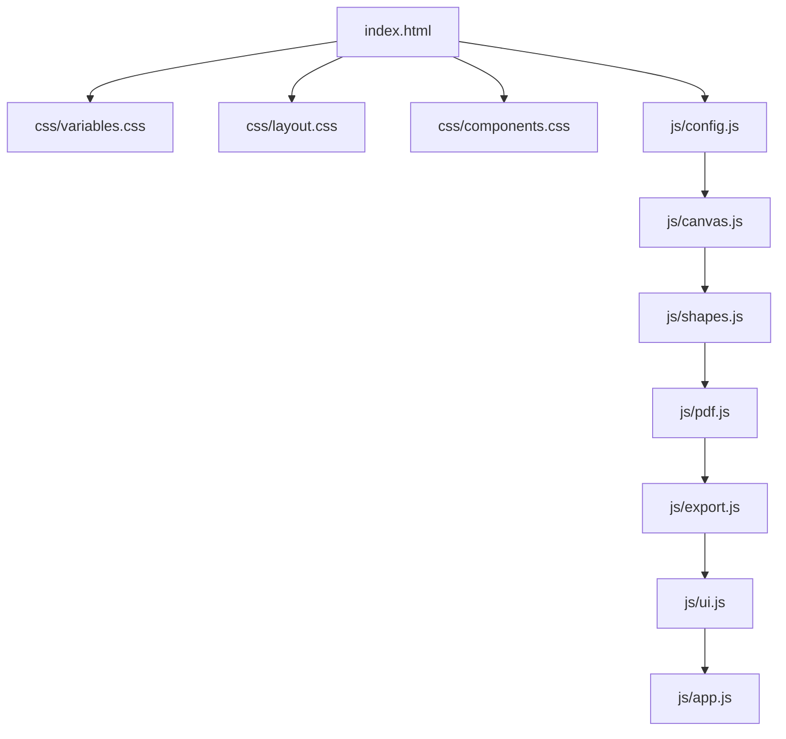

# Arquitetura e Mapa do Sistema - Recorte em A3/A4

Este documento descreve a arquitetura detalhada da aplicação, a estrutura de módulos, a gestão de estado e os fluxos de dados do sistema.

---

## 🏗️ Visão Geral da Arquitetura

O sistema é construído como uma **Single Page Application (SPA) Estática e Modulada** em JavaScript Vanilla, utilizando o **Fabric.js** como motor de renderização de canvas interativo 2D.

---

## 🔄 Ordem de Carregamento e Dependências

Para garantir o funcionamento correto sem bundlers ou módulos ES6 (mantendo compatibilidade universal com HTTP estático), os arquivos JavaScript são carregados na seguinte sequência estrita de dependências:

1. **`js/config.js`**: Estado global (`canvas`, `grid`, `bgObj`, `fonts`, `SIZES`, `PXM`).
2. **`js/canvas.js`**: Motor do canvas, réguas de medição, renderizador de grid e pilha de undo/redo.
3. **`js/shapes.js`**: Fábrica de elementos (formas, textos, imagens), leitor de fontes e recorte.
4. **`js/pdf.js`**: Leitor PDF.js e algoritmo de distribuição de páginas no grid.
5. **`js/export.js`**: Exportação em alta resolução (jsPDF, JSZip, FileSaver) e serialização JSON.
6. **`js/ui.js`**: Controle da interface, atalhos de teclado, drag & drop, clipboard e botões flutuantes.
7. **`js/app.js`**: Bootstrap (`window.onload`) inicializando escutas globais e canvas.

---

## 📦 Detalhamento dos Módulos

### 1. Módulo de Configuração (`js/config.js`)
Guarda as constantes do domínio e o estado reativo da aplicação:
- `SIZES`: Dimensões em milímetros para A4 (`210x297`) e A3 (`297x420`).
- `PXM`: Multiplicador de escala de pixels por milímetro (`3px/mm`).
- `grid`: Objeto contendo o número de colunas, linhas, orientação e tamanho da página.
- `historyUndo` / `historyRedo`: Pilhas de histórico com limite de 10 estados.
- `fonts`: Lista de 24 fontes integradas do Google Fonts.

### 2. Motor do Canvas (`js/canvas.js`)
Gerencia o ciclo de vida do Fabric.js e a renderização técnica:
- `initCanvas()`: Configura a instância do Fabric.Canvas com suporte a touch e redimensionamento dinâmico.
- `setupCustomControls()`: Sobrescreve os controles visuais do Fabric para incluir os botões de **Editar (Editar/Cortar)**, **Excluir (Fechar)** e **Camadas**.
- `renderOverlay()`: Desenha o fundo escuro fora da área útil de impressão, réguas dinâmicas em centímetros e linhas guias de corte.
- `updateGrid()`: Atualiza as dimensões do retângulo de fundo (`bgObj`) e recentraliza a visualização (`resetView()`).
- `saveHistory()` / `restoreCanvasState()`: Serializa o estado completo do canvas via `JSON.stringify`, preservando as propriedades customizadas `isBackground` e `gridConfig`.
- `setupHammerGestures()`: Integração com Hammer.js para suporte fluido a gestos de **Pinch Zoom** e **Pan (arraste com 2 dedos)**.

### 3. Gerenciador de Elementos e Estilos (`js/shapes.js`)
Responsável pela criação e customização de objetos no canvas:
- `addShape(type)`: Instancia formas (retângulo, círculo, triângulo, pentágono, coração, balão, estrela).
- `createLabel()`: Adiciona campo de texto `IText` centralizado e ativa o modo de edição imediata.
- `updateShapeProps()`: Atualiza cor de preenchimento, cor de borda, espessura e arredondamento (`rx`/`ry`).
- `loadFonts()` / `changeFont()`: Carrega dinamicamente a fonte selecionada via `WebFont.load` e aplica ao preview e ao objeto selecionado.
- `startCrop()` / `applyCrop()`: Abre modal integrado com `Cropper.js` para recortes de imagem sem perda de resolução.
- `layerAction(action)`: Controla a profundidade z-index dos objetos (`front`, `up`, `down`, `back`).

### 4. Processador de PDFs (`js/pdf.js`)
Converte páginas PDF em imagens de alta definição para inserção no canvas:
- `processPDFFile()`: Carrega o arquivo arrayBuffer através do worker PDF.js.
- `showPDFPageSelection()`: Gera miniaturas em grid para seleção de página única quando o PDF contém múltiplas páginas.
- `importAllPDFPages()`: Calcula automaticamente o grid de linhas e colunas ideal e posiciona todas as páginas do PDF distribuídas uniformemente nas células do grid.

### 5. Motor de Exportação (`js/export.js`)
Trata a renderização final para impressão profissional:
- `processExport(type)`:
  - `pdf`: Gera documento PDF único contendo cada célula do grid em uma página separada.
  - `pdf-split`: Gera um arquivo ZIP contendo um PDF individual por página do grid.
  - `img-split`: Gera um arquivo ZIP contendo imagens JPG individuais em alta resolução por página.
  - `img-single`: Exporta todo o painel de cartazes montado em uma única imagem JPG.
- `saveProject()` / `loadProject()`: Salva e restaura o projeto em formato JSON editável contendo todas as camadas, fontes e configurações do grid.

### 6. Interface de Usuário e Eventos (`js/ui.js`)
- `setupDraggableSheets()`: Habilita gestos touch para arrastar e fechar as folhas inferiores (`.sheet`).
- `setupKeyboardShortcuts()`: Captura teclas de atalho globais:
  - `Delete` / `Backspace`: Remove elemento selecionado.
  - `Ctrl+Z` / `Cmd+Z`: Desfazer (Undo).
  - `Ctrl+Y` / `Cmd+Y`: Refazer (Redo).
  - `Ctrl+C` / `Cmd+C`: Copiar objeto.
  - `Espaço`: Alterna para o modo Mão (Pan).
- `handleGlobalPaste()` / `processPasteText()`: Trata a colagem global de arquivos de mídia, imagens e textos vindos da área de transferência.
- `updateFloatingButton()`: Exibe o botão inteligente "Trocar texto" sobre objetos de texto selecionados.

---

## 🎨 Arquitetura CSS

A camada de estilização é dividida em três níveis de especificidade:

1. **`css/variables.css`**: Contém as variáveis do tema `:root`:
   - `--primary`: `#6366f1` (Violeta / Índigo Elétrico)
   - `--accent`: `#10b981` (Menta Neon / Esmeralda)
   - `--bg-dark`: `#0f172a` (Fundo Dark Slate do workspace)
   - `--surface`: `#1e293b` (Superfície dos menus, modais e bottom sheets)
   - Suporte a unidades dinâmicas mobile (`100dvh`) e resets gerais.
2. **`css/layout.css`**: Define o posicionamento absoluto do `#header`, `#toolbar`, `#mode-toggle` e container `#canvas-wrapper`. Respeita as insets de tela segura do iOS (`env(safe-area-inset-top)` e `env(safe-area-inset-bottom)`).
3. **`css/components.css`**: Estiliza os modais (`#loader`, `#info-modal`, `#pdf-modal`, `#cropper-modal`), botões de salvamento (`.btn-save`), menu suspenso (`.export-menu`), bottom sheets (`.sheet`), seletores de fonte e botões flutuantes.

---

## ⚠️ Regras e Boas Práticas para Manutenção

1. **Preservar `index.html` na raiz**: Nunca remover a raiz `index.html` para não quebrar a publicação no Vercel ou GitHub Pages.
2. **Flags de Objetos Fabric**: Ao alterar objetos de fundo ou suporte, mantenha a flag `isBackground: true` para que o sistema de histórico e renderização de réguas identifique corretamente o retângulo base.
3. **Gerenciamento de Touch**: Todo elemento de scroll interno (como `.font-scroll-box` ou `.sheet-content`) deve conter `touch-action: pan-y !important;` para permitir rolagem vertical sem colidir com os gestos do Fabric Canvas.
4. **Preservação de Atalhos**: Sempre verificar se o usuário não está digitando em um campo de texto (`isEditing`) antes de acionar atalhos globais de exclusão ou movimentação.
